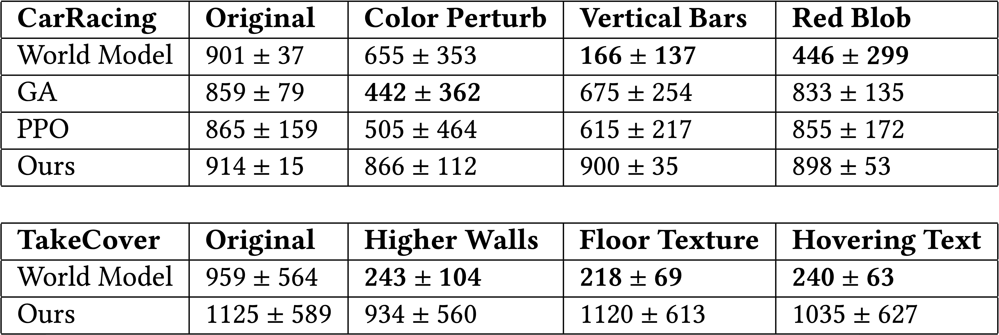

## Abstract 

Inattentional blindness is the psychological phenomenon that causes one to miss things in plain sight.
It is a consequence of the selective attention in perception that lets us remain focused on important parts of our world without distraction from irrelevant details.
Motivated by selective attention, we study the properties of artificial agents that perceive the world through the lens of a *self-attention* bottleneck. By constraining access to only a small fraction of the visual input, we show that their policies are directly interpretable in pixel space.
We find neuroevolution ideal for training self-attention architectures for vision-based reinforcement learning tasks, allowing us to incorporate modules that can include discrete, non-differentiable operations which are useful for our agent.
We argue that self-attention has similar properties as *indirect encoding*, in the sense that large implicit weight matrices are generated from a small number of key-query parameters, thus enabling our agent to solve challenging vision based tasks with at least 1000x fewer parameters than existing methods.
Since our agent attends to only task-critical visual hints, they are able to generalize to environments where task irrelevant elements are modified while conventional methods fail.

______

## Introduction

There is much discussion in the deep learning community about the generalization properties of large neural networks. While larger neural networks generalize better than smaller networks, the reason is not that they have more weight parameters, but as recent work (e.g. <dt-cite key="frankle2018the,zhou2019deconstructing,ramanujan2019s"></dt-cite>) suggests, it is because larger networks allow the optimization algorithm to find good solutions, or *lottery tickets* <dt-cite key="frankle2018the"></dt-cite>, within a small fraction of the allowable solution space. These solutions can then be pruned to form sub-networks with useful *inductive biases* that have desirable generalization properties.

Recent neuroscience critiques of deep learning (e.g. <dt-cite key="zador2019critique,wann2019,hasson2020direct"></dt-cite>) point out that *animals are born with highly structured brain connectivity* that are *far too complex to be specified explicitly in the genome* and *must be compressed through a “genomic bottleneck”*--information encoded into the genome that specify a set of rules for wiring up a brain <dt-cite key="zador2019critique"></dt-cite>. Innate processes and behaviors are encoded by evolution into the genome, and as such *many of the neuronal circuits in animal brains are pre-wired, and ready to operate from birth <dt-cite key="hasson2020direct"></dt-cite>.* These innate abilities make it easier for animals to generalize and quickly adapt to different environments <dt-cite key="beyret2019animal"></dt-cite>.

There is actually a whole area of related research within the neurevolution field on evolving this *genetic bottleneck*, which is called an *indirect encoding*. Analogous to the pruning of lottery ticket solutions, indirect encoding methods allow for both the expressiveness of large neural architectures while minimizing the number of free model parameters. We believe that the foundations laid by the work on indirect encoding can help us gain a better understanding of the *inductive biases*<dt-fn>The *inductive bias* of a learning algorithm is the set of assumptions that the learner uses to predict outputs given inputs that it has not yet encountered. ([Wikipedia](https://en.wikipedia.org/wiki/Inductive_bias))</dt-fn> of neural networks and possibly offer a fresh perspective for approaching out-of-domain generalization problems.

<!-- and possibly offer a fresh perspective for approaching generalization problems posed by the RL research community.

<video class="b-lazy" data-src="assets/mp4/pineau2018.mp4" type="video/mp4" controls playsinline style="width: 95%;" ></video>
<figcaption style="text-align: left; padding-top: 0;">
Joelle Pineau's <dt-cite key="pineau2018">invited talk</dt-cite> at NeurIPS2018 drew our attention to the fact that humans can play Atari games even in the presence of much distraction to the game's visuals, and encouraged the AI research community to explore these challenges. In this work, our aim is to convince you that self-attention and neuroevolution are encouraging stepping stones for this direction of research. (Click Video to Play.) 
</figcaption>

-->

<figcaption>
HyperNEAT <dt-cite key="stanley2009hyperneat"></dt-cite> is an indirect encoding method that can generate a variety of weight patterns with structured regularities. Here are examples (taken from <dt-cite key="clune2011performance"></dt-cite>) of fully connected networks (<i>phenotype</i>) where the weights are not individually trained, but generated by a smaller neural network (<i>genotype</i>). The weight of each connection is a function of its location within the network. The thickness represents the magnitude of its weight. 
</figcaption>

Most current methods used to train neural networks, whether with gradient descent or evolution strategies, aim to solve for the value of each individual weight parameter of a given neural network. We refer to these methods as *direct encoding* methods.
*Indirect encoding* <dt-cite key="stanley2003taxonomy,schmidhuber1997discovering"></dt-cite>, on the other hand, offers a radically different approach. These methods optimize instead for a *small* set of rules or operations, referred to as the *genotype*, that specify how the (much larger) neural network (the *phenotype*) should be generated.<dt-fn>These terms in the evolutionary computing literature were taken from the evolutionary biology field, where the *genotype* is the part of the genetic makeup of a cell, and therefore of any individual organism, which determines the organism's actual observed properties, such as morphology, development, or behavior (the *phenotype*) ([Wikipedia](https://en.wikipedia.org/wiki/Genotype%E2%80%93phenotype_distinction))</dt-fn>
In general, the phenotype encompasses both the neural architecture and its weights, but contemporary indirect encoding methods (e.g. <dt-cite key="stanley2009hyperneat,koutnik2013evolving"></dt-cite>) typically generate only the weights of a pre-defined architecture using a small set of genotype parameters.

Before the popularity of Deep RL, indirect encoding methods in the neuroevolution literature have been a promising approach for the types of problems that eventually used Deep RL solutions.
In the case of vision-based RL problems, earlier works demonstrated that large neural networks can be encoded into much smaller, genotype solutions, that are capable of playing Atari from pixels <dt-cite key="hausknecht2012hyperneat"></dt-cite> (when it was still considered challenging in 2012) or car racing directly from pixel-only inputs <dt-cite key="koutnik2013evolving"></dt-cite>, hinting at the potential power of indirect encoding.
Even before deep learning and convolutional networks started to gain traction in 2012 <dt-cite key="krizhevsky2012imagenet"></dt-cite>, indirect encoding has enabled neural network controllers to play board games with structural regularities such as Checkers <dt-cite key="gauci2008case"></dt-cite> and Go <dt-cite key="gauci2010indirect"></dt-cite>.

By encoding the weights of a large model with a small number of parameters, we can substantially reduce the search space of the solution, at the expense of restricting our solution to a small subspace of all possible solutions offered by direct encoding methods. This constraint naturally incorporates into our agent an inductive bias that determines what it does well at <dt-cite key="wann2019,zador2019critique,hasson2020direct"></dt-cite>, and this inductive bias is dependent on the choice of our indirect encoding method. For instance, HyperNEAT <dt-cite key="stanley2009hyperneat"></dt-cite> has been successful at robotic gait control <dt-cite key="clune2009evolving,risi2013confronting"></dt-cite>, suggesting CPPNs<dt-fn>Compositional pattern-producing network (CPPN) is the genotype in the HyperNEAT⁠ algorithm—a small neural network that produces patterns and regularities that define the weights of a larger phenotype network. ([Wikipedia](https://en.wikipedia.org/wiki/Compositional_pattern-producing_network))</dt-fn> <dt-cite key="stanley2007cppn"></dt-cite> to be effective at representing modular and symmetric properties suitable for locomotion. But are there indirect encoding methods that are better suited for vision-based RL tasks?

<figcaption style="text-align: left; color:#000; padding-top: 0;">Car Racing environment</figcaption>
<video class="b-lazy" src="https://storage.googleapis.com/quickdraw-models/sketchRNN/attention/assets/mp4/carracing_stages.mp4" type="video/mp4" autoplay muted playsinline loop style="margin: 0; width: 100%;" ></video>
<figcaption style="text-align: left; color:#000; padding-top: 0;">Take Cover environment</figcaption>
<video class="b-lazy" src="https://storage.googleapis.com/quickdraw-models/sketchRNN/attention/assets/mp4/takecover_stages.mp4" type="video/mp4" autoplay muted playsinline loop style="margin: 0; width: 100%;" ></video>
<figcaption style="text-align: left; color:#FF6C00; padding-top: 0;">Perceiving the world through a self-attention bottleneck</figcaption>
<figcaption style="text-align: left; padding-top: 0;">
Our agent receives visual input as a stream of 96x96px RGB images (<i>left</i>). Each image frame is passed through a self-attention bottleneck module, responsible for selecting K=10 patches (highlighted in white, <i>middle</i>). Features from these K patches (such as location) are then routed to a decision-making controller (<i>right</i>) that will produce the agent's next action. The parameters of the self-attention module and the controller are trained together using neuroevolution. 
</figcaption>

In this work, we establish that *self-attention* can be viewed as a form of indirect encoding, which enables us to construct highly parameter-efficient agents.
We investigate the performance and generalization properties of these agents for vision-based RL tasks.
Self-attention has been popularized by Transformer <dt-cite key="NIPS2017_7181"></dt-cite> models that have been successfully applied in domains such as natural language processing <dt-cite key="devlin-etal-2019-bert,radford2019language"></dt-cite> and vision <dt-cite key="DBLP:journals/corr/abs-1911-03584,DBLP:conf/nips/ParmarRVBLS19,hu2019local,bello2019attention"></dt-cite>. As we will explain,
self-attention offers a simple yet powerful approach for parameterizing a large weight matrix of size $\mathcal{O}(n^2)$ using only $\mathcal{O}(d)$ number of parameter values, where $n$ is the size of the visual input, $d$ is the dimension of some transformed space and $n \gg d$.
Furthermore, such a parameterization enforces an inductive bias to encourage our agent to attend to only a small fraction of its visual input, and as such naturally makes the agent more interpretable.

<video class="b-lazy" src="https://storage.googleapis.com/quickdraw-models/sketchRNN/attention/assets/mp4/takecover_mods.mp4" type="video/mp4" autoplay muted playsinline loop style="margin: 0; width: 98.5%;" ></video>
<figcaption style="text-align: left; color:#FF6C00; padding-top: 0;">Environments outside of training distribution for Take Cover</figcaption>
<figcaption style="text-align: left; padding-top: 0;">
In psychology, <dt-cite key="mack1998inattentional">inattentive blindness</dt-cite> results from a lack of attention that is not associated with vision defects, as individuals fail to perceive an unexpected stimulus in plain sight. Mack and Rock<dt-cite key="mack1998inattentional"></dt-cite> make the radical claim <i>that there is no conscious perception of the visual world without attention to it</i>. In this work, we model this phenomenon in simulation and restrict our agent's decision-making controller access only a small faction of its visual input. We demonstrate that an agent's <i>inattentive blindness</i> can result in better generalization, simply due to its ability to “not see things” that can confuse it. Here, our agent is evolved to survive in the top-left environment only, but it can also survive in unseen settings with higher walls, different floor textures, or when confronted with a distracting sign. 
</figcaption>

As we will show, neuroevolution is an ideal method for training self-attention agents, because not only can we remove unnecessary complexity required for gradient-based methods, resulting in much simpler architectures, we can also incorporate modules that enhance the effectiveness of self-attention that need not be differentiable. We showcase self-attention agents trained with neuroevolution that require 1000x fewer parameters than conventional methods and yet is able to solve challenging vision-based RL tasks. Specifically, with less than 4000 parameters, our self-attention agents can reach average scores of 914 over 100 consecutive trials in a 2D car racing task <dt-cite key="brockman2016openai"></dt-cite> and 1125 in a 3D VizDoom task <dt-cite key="DBLP:journals/tciaig/WydmuchKJ19"></dt-cite> (the tasks are considered solved for scores >900 and >750), comparable with existing state-of-the-art (SOTA) results in <dt-cite key="ha2018worldmodels,DBLP:conf/gecco/RisiS19,DBLP:journals/corr/abs-2001-01683"></dt-cite>. Moreover, our agent learns to attend to only task-critical visual spots and is therefore able to generalize to environments where task irrelevant elements are modified whereas conventional methods fail.

<video class="b-lazy" src="https://storage.googleapis.com/quickdraw-models/sketchRNN/attention/assets/mp4/carracing_mods.mp4" type="video/mp4" autoplay muted playsinline loop style="margin: 0; width: 98.5%;" ></video>
<figcaption style="text-align: left; color:#FF6C00; padding-top: 0;">Environments outside of training distribution for Car Racing</figcaption>
<figcaption style="text-align: left; padding-top: 0;">
Humans who learn to drive during a sunny day can (to some extent) also drive at night, on a rainy day, in a different car, or in the presence of bird droppings on the windshield. Our self-attention agent is not only able to solve CarRacing-v0<dt-cite key="CarRacing-v0"></dt-cite>, achieving an average score > 900, it can also achieve similar performance in unseen conditions (such as brighter or darker scenery, or having its vision modified by artifacts such as side bars or background blobs), while requiring 1000x fewer parameters than conventional methods that fail to generalize. 
</figcaption>

The goal of this work is to showcase self-attention as a powerful tool for the neuroevolution toolbox, and we will open-source code for reproducing our experiments. We hope our results will encourage further investigation into the neuroevolution of self-attention models, and also revitalize interest in indirect encoding methods.

______

## Background on Self-Attention

We now give a brief overview of self-attention. Here, we describe a simpler subset of the full Transformer <dt-cite key="NIPS2017_7181"></dt-cite> architecture used in this work. In particular, we omit *Value* matrices, *positional encoding*, *multi-head attention* from our method, and opt for the simplest variation that complements neuroevolution methods for our purpose. 
We refer to <dt-cite key="bloem2018"></dt-cite> for an in-depth overview of the Transformer model.

Let $X \in\;\mathcal{R}^{n \times d_{in}}$ be an input sequence of $n$ elements (e.g. number of words in a sentence, pixels in an image), each of dimensions $d_{in}$ (e.g. word embedding size, RGB intensities).
Self-attention module calculates an *attention score matrix* and a weighted output:

$$
\begin{aligned}
   A&=\text{softmax}\big(\frac{1}{\sqrt{d_{in}}}(X W_k) (X W_q)^\intercal \big) & (1) \\
   Y&=A X & (2)
\end{aligned}
$$

where $W_k, W_q \in\;\mathcal{R}^{d_{in} \times d}$ are matrices that map the input to components called *Key* and *Query* ($\text{Key} = XW_k, \text{Query} = XW_q$), $d$ is the dimension of the transformed space and is usually a small integer.
Since the average value of the dot product grows with the vector's dimension, each entry in the Key and Query matrices can be disproportionally too large if $d_{in}$ is large. To counter this, the factor $\frac{1}{\sqrt{d_{in}}}$ is used to normalize the inputs.
Applying the $\text{softmax}$<dt-fn>$\text{softmax}(x_i) = \exp(x_i) / \sum_{k}{\exp(x_k)}$</dt-fn> operation along the rows of the matrix product in Equation 1, we get the attention matrix $A \in\;\mathcal{R}^{n \times n}$, where each row vector of $A$ sums to $1$.
Thus, each row of output $Y \in\;\mathcal{R}^{n \times d_{in}}$ can be interpreted as a weighted average of the input $X$ by each row of the attention matrix.

<figcaption style="text-align: left; padding-top: 0;">
<b>Visualizing Attention Layers </b> from the Transfomer model. Figures from <dt-cite key="opennmt">The Annotated Transformer</dt-cite>. 
</figcaption>

Self-attention lets us map arbitrary input $X$ to target output $Y$, and this mapping is determined by an attention matrix $A$ parameterized by much smaller Key and Query parameters, which can be trained using machine learning techniques. The self-attention mechanism is at the heart of recent SOTA methods for translation and language modeling <dt-cite key="devlin-etal-2019-bert,radford2019language"></dt-cite>, and has now become a common place method for natural language processing domain.

### Self-Attention for Images

Although self-attention is broadly applied to sequential data, it is straightforward to adapt it to images.
For images, the input is a tensor $X \in\;\mathcal{R}^{H \times W \times C}$ where $H$ and $W$ are the height and width of the image, $C$ is the number of image channels (e.g., 3 for RGB, 1 for gray-scale).
If we reshape the image so that it becomes $X \in\;\mathcal{R}^{n \times d_{in}}$ where $n = H \times W$ and $d_{in} = C$, all the operations defined in Equations 1-2 are valid and can be readily applied.
In the reshaped $X$, each row represents a pixel and the attentions are between pixels. Notice that the complexity of Equation 1 grows quadratically with the number of rows in $X$ due to matrix multiplication, it therefore becomes computationally prohibitive when the input image is large.
While down-sampling the image before applying self-attention is a quick fix, it is accompanied with performance trade-off. For more discussion and methods to partially overcome this trade-off for images, see <dt-cite key="DBLP:conf/nips/ParmarRVBLS19,DBLP:journals/corr/abs-1911-03584"></dt-cite>.

<figcaption>
Rather than applying self-attention on individual pixels, we extract patches from an input image using a slide window. We will explain the approach in greater detail later on in the <i>Self-Attention Agent</i> section. 
</figcaption>

Instead of applying operations on individual pixels of the entire input, a popular method for image processing is to organize the image into patches and take them as inputs as described in previous work (e.g. <dt-cite key="DBLP:journals/corr/abs-1905-02793,Ding2019ImprovingSS"></dt-cite><dt-cite key="DBLP:journals/corr/abs-1904-01784,NIPS2019_8359"></dt-cite>). In our approach, our agent attends to patches of the input rather than individual pixels, and we use a sliding window to crop the input image in our input transformations. Conceptually, our approach is similar to *Spatial Softmax* <dt-cite key="finn2016deep,suwajanakorn2018discovery,kulkarni2019unsupervised"></dt-cite>, which compresses visual inputs into a set of 2D keypoints that are relevant to the task.
This has been shown to work on robot perception tasks, and in some cases the keypoints are spatially interpretable.
______

## Self-Attention as a form of Indirect Encoding

Indirect encoding methods represent the weights of a neural network, the *phenotype*, with a smaller set of *genotype* parameters. How a genotype encodes a larger solution space is defined by the indirect encoding algorithm. HyperNEAT <dt-cite key="stanley2009hyperneat"></dt-cite> encodes the weights of a large network via a coordinate-based CPPN-NEAT <dt-cite key="stanley2007cppn"></dt-cite> network, while Compressed Network Search <dt-cite key="koutnik2013evolving"></dt-cite> uses discrete cosine transform to compress the weights of a large weight matrix into a small number of DCT coefficients, similar to JPEG compression. Examples of patterns produced with these methods:

<table style="width: 100%;" cellspacing="0" cellpadding="0"><tr>
<td style="width: 33.3%;border: 1px solid transparent;">

</td>
<td style="width: 33.3%;border: 1px solid transparent;">

</td>
<td style="width: 33.3%;border: 1px solid transparent;">

</td>
</tr>
</table>

<figcaption style="text-align: left; padding-top: 0;">
<b>Patterns produced using CPPN-NEAT <dt-cite key="stanley2007cppn,otorogallery"></dt-cite>.</b>  Rich pattern-generators that produce structured regularities can be used in <i>indirect encoding</i> methods to produce weight values of large neural networks, as demonstrated in HyperNEAT <dt-cite key="stanley2009hyperneat"></dt-cite>. (Click Image to Enlarge) 
</figcaption>

<table style="width: 100%;" cellspacing="0" cellpadding="0"><tr>
<td style="width: 33.3%;border: 1px solid transparent;">

</td>
<td style="width: 33.3%;border: 1px solid transparent;">

</td>
<td style="width: 33.3%;border: 1px solid transparent;">

</td>
</tr>
</table>

<figcaption style="text-align: left; padding-top: 0;">
<b>Compressed Network Search <dt-cite key="koutnik2013evolving"></dt-cite></b> uses Discrete Cosine Transform to generate a large number of feature detectors using only a small number of learnable coefficients. The patterns generated also exhibit regular patterns useful for continuous control tasks. (Click Image to Enlarge) 
</figcaption>

Due to compression, the space of possible weights an indirect encoding scheme can produce is only a small subspace of all possible combination of weights. The constraint on the solution space resulting from indirect encoding enforces an inductive bias into the phenotype. While this bias determines the types of tasks that the network is *naturally* suited at doing, it also restricts the network to a subset of all possible tasks that an unconstrained phenotype can (in theory) perform. More recent works have proposed ways to broaden its task domain of indirect encoding. ES-HyperNEAT <dt-cite key="risi2012enhanced"></dt-cite> proposed adapting part of the indirect encoding algorithm itself to the task environment. Hypernetworks <dt-cite key="ha2017hypernetworks"></dt-cite> suggested making the phenotype directly dependent on the inputs, thus tailoring the weights of the phenotype to the specific inputs of the network. Following this approach of incorporating information from the input into the weight-generating process, it has been shown <dt-cite key="munkhdalai2017meta,chen2018neural"></dt-cite><dt-cite key="dumoulin2018featurewise,Oswald2020Continual"></dt-cite> that the phenotype can be highly expressive as the weights can adapt to the inputs for the task at hand, while static indirect encoding methods cannot.

<video class="b-lazy" src="https://storage.googleapis.com/quickdraw-models/sketchRNN/attention/assets/mp4/hypernetworks_example.mp4" type="video/mp4" autoplay muted playsinline loop style="width: 100%; padding-top: 0; padding-bottom: 0;" ></video>

<figcaption style="text-align: left; padding-top: 0;">
 <b>Hypernetworks</b> <dt-cite key="ha2017hypernetworks"></dt-cite> is an example of a <i>dynamic</i> indirect encoding method where the weights produced are allowed to change over time. When we train a hypernetwork model to generate synthetic handwriting or text, the model samples an action from a probability distribution conditioned on its internal state, and performs the action. But unlike conventional RNNs, its weights (represented by the four colors) can change over time, and is dependent on the agent's internal state and inputs (its previous action). Self-attention is also a form of dynamic indirect encoding as the weights produced are also dependent on the agent's senses and will vary over time. 
</figcaption>

Similarly, self-attention enforces a structure on the attention weight matrix $A$ in Equation 1 that makes it also input-dependent. If we remove the Key and Query terms, the outer product $X X^T$ defines an association matrix <dt-fn>$X X^T$ are also known as Gram matrices, and are key to all of kernel methods and classical statistical learning. ([Wikipedia](https://en.wikipedia.org/wiki/Gramian_matrix))</dt-fn> where the elements are large when two distinct input terms are in agreement. This type of structure enforced in $A$ has been shown to be suited for associative tasks where the downstream agent has to learn the relationship between unrelated items. For example, they are used in the Hebbian learning <dt-cite key="hebb1949organization"></dt-cite> rule inspired by *neurons that fire together wire together*, shown to be useful for associative learning <dt-cite key="ba2016using,miconi2018differentiable"></dt-cite>. Matrix factorization applied to weights has been proposed in the deep learning literature <dt-cite key="sainath2013low,grosse2016kronecker"></dt-cite>, and are also present in recommender systems <dt-cite key="koren2009matrix"></dt-cite> to represent relationships between different inputs.

<figcaption style="text-align: left; padding-top: 0;">
<b>Visualization of Large Attention Layers </b> from the <dt-cite key="dai2019transformer">Transfomer-XL</dt-cite> model. (Click Image to Enlarge) 
</figcaption>

As the outer product $X X^T$ so far has no free parameters, the corresponding matrix $A$ will not be suitable for arbitrary tasks beyond association. The role of the small Key ($W_k$) and Query ($W_q$) matrices in Equation 1 allow $A$ to be modified for the task at hand. $W_k$ and $W_q$ can be viewed as the *genotype* of this indirect-encoding method.

$W_k, W_q \in \mathcal{R}^{d_{in} \times d}$ are the matrices that contain the free parameters, $d_{in}$ is a constant with image inputs (3 for RGB images and 1 for gray scale images), therefore the number of free parameters in self-attention is in the order of $\mathcal{O}(d)$.
As we explained previously, when applying self-attention to images $n$ can be the number of pixels in an input the magnitude of which is often tens of thousands even for small images (e.g. 100px × 100px). On the other hand, $d$ is the dimension of the transformed space in which the Key and Query matrices reside and is often much smaller than $n$ ($d=4$ in our experiments). This form of indirect encoding enables us to represent the phenotype, the attention matrix $A$, of size $\mathcal{O}(n^2)$ using only $\mathcal{O}(d)$ number of genotype parameters. In our experiments, we show that our attention matrix $A$ can be represented using only $\sim$ 1200 trainable genotype parameters.

Furthermore, we demonstrate that features from this attention matrix is especially useful to a downstream decision-making controller. We find that even if we restrict the size of our controller to only $\sim$ 2500 parameters, it can still solve challenging vision-based tasks by leveraging the information provided by self-attention.

______

## Self-Attention Agent

The design of our agent takes inspiration from concepts related to inattentive blindness <dt-cite key="mack1998inattentional"></dt-cite>--when the brain is involved in effort-demanding tasks, it assigns most of its attention capacity only to task relevant elements and is temporarily blind to other signals <dt-cite key="mack1998inattentional,kahneman2011thinking"></dt-cite>.
In this vein, our agent is designed to focus on only task-critical regions in the input image and will ignore the others. 

The following figure depicts an overview of our self-attention agent:

 

<figcaption>
<b>Method overview.</b> Illustration of data processing flow in our self-attention agent. We will explain each module in greater detail later on in this section. (Click Image to Enlarge) 
</figcaption>

There are four stages of information processing:

**Input Transformation**&nbsp;Given an observation, our agent first resizes it into an input image of shape $L \times L$, the agent then segments the image into $N$ patches and regard each patch as a potential region to attend to.

**Importance Voting via Self-Attention**&nbsp;To decide which patches are appropriate, the agent passes the patches to the self-attention module to get a vector representing each patch's importance, based on which it selects $K$ patches of the highest importance.

**Patch Selection and Feature Retrieval**&nbsp;Our agent then uses the index ($k$) of each of the $K$ patches to fetch relevant features of each patch with a function $f(k)$, which can be either a learned module or a pre-defined function that incorporates domain knowledge.

**Controller**&nbsp;Finally, the agent inputs the features into its controller that outputs the action it will execute in its environment.

Each of these stages will be explained in greater detail in this section.

<figcaption style="text-align: left; padding-top: 0;">
 <b>Hyper-parameters in this paper.</b> Left: Parameters for input transformation. After resizing the observation into an image of shape L × L, we use a sliding window of specified size and stride to segment the image into <math><semantics><mrow><mi>N</mi><mo>=</mo><mo>(</mo><mrow><mo fence="true">⌊</mo><mfrac><mrow><mi>L</mi><mo>−</mo><mi>M</mi></mrow><mrow><mi>S</mi></mrow></mfrac><mo>+</mo><mn>1</mn><mo fence="true">⌋</mo></mrow><msup><mo>)</mo><mn>2</mn></msup><mo>=</mo><mo>(</mo><mrow><mo fence="true">⌊</mo><mfrac><mrow><mn>9</mn><mn>6</mn><mo>−</mo><mn>7</mn></mrow><mrow><mn>4</mn></mrow></mfrac><mo>+</mo><mn>1</mn><mo fence="true">⌋</mo></mrow><msup><mo>)</mo><mn>2</mn></msup><mo>=</mo><mn>5</mn><mn>2</mn><mn>9</mn></mrow><annotation encoding="application/x-tex">N = (\left \lfloor \frac{L-M}{S} + 1 \right \rfloor)^2 = (\left \lfloor \frac{96 - 7}{4} + 1 \right \rfloor)^2 = 529</annotation></semantics></math>N=(⌊​S​​L−M​​+1⌋)​2​​=(⌊​4​​96−7​​+1⌋)​2​​=529 patches.
Right: Parameters for self-attention. Since the attention is between patches and each patch is RGB, we therefore have <math><semantics><mrow><msub><mi>d</mi><mrow><mi>i</mi><mi>n</mi></mrow></msub><mo>=</mo><msup><mi>M</mi><mn>2</mn></msup><mo>×</mo><mi>C</mi><mo>=</mo><msup><mn>7</mn><mn>2</mn></msup><mo>×</mo><mn>3</mn><mo>=</mo><mn>1</mn><mn>4</mn><mn>7</mn></mrow><annotation encoding="application/x-tex">d_{in} = M^2 \times C = 7^2 \times 3 = 147</annotation></semantics></math>d​in​​=M​2​​×C=7​2​​×3=147. 
</figcaption>

To gain a better sense of the magnitudes involved, we summarize the hyper-parameters used in this work in the table above. Some of the parameters are explained in the following sections.

<figcaption style="text-align: left; color:#000; padding-top: 0;">Car Racing environment</figcaption>
<video class="b-lazy" src="https://storage.googleapis.com/quickdraw-models/sketchRNN/attention/assets/mp4/carracing_stages.mp4" type="video/mp4" autoplay muted playsinline loop style="margin: 0; width: 100%;" ></video>
<figcaption style="text-align: left; color:#000; padding-top: 0;">Take Cover environment</figcaption>
<video class="b-lazy" src="https://storage.googleapis.com/quickdraw-models/sketchRNN/attention/assets/mp4/takecover_stages.mp4" type="video/mp4" autoplay muted playsinline loop style="margin: 0; width: 100%;" ></video>
<figcaption style="text-align: left; color:#FF6C00; padding-top: 0;">Visualizing the various stages of information processing in action</figcaption>
<figcaption style="text-align: left; padding-top: 0;">
<b>Input Transformation</b>&nbsp;Our agent's' visual input is resized to 96x96px RGB images, and divided up into patches. (<i>left</i>) 
<b>Importance Voting via Self-Attention</b>&nbsp;This module votes for the top K=10 patches (highlighted in white). (<i>middle</i>) 
<b>Patch Selection and Feature Retrieval</b>&nbsp;Features from these K patches (such as location) routed to <b>Controller</b>. (<i>right</i>)
</figcaption>

### Input Transformation

Our agent does some basic image processing and then segments an input image into multiple patches.
For all the experiments in this paper, our agent receives RGB images as its input, therefore we simply divide each pixel by 255 to normalize the data, but it should be straightforward to integrate other data preprocessing procedures.
Similarly, while there can be various methods for image segmentation, we find a simple sliding window strategy to be sufficient for the tasks in this work.

<figcaption>
After some basic image pre-processing, we extract patches from an input image using a slide window of size M×M and stride S. This results in an output shape of (N, M, M, C), where N is the number of patches, M is the height / width of each patch, and C is the number of channels in the input image. We then flatten the data. 
</figcaption>

To be concrete, when the window size $M$ and stride $S$ are specified, our agent chops an input of shape $(H, W, C)$ into a batch of $N$ patches of shape $(M, M, C)$, where $H$ and $W$ are the height and width of the input image and $C$ is the number of channels.
We then reshape the processed data into a matrix of shape $(N, M \times M \times C)$ before feeding it to the self-attention module.
$M$ and $S$ are hyper-parameters to our model, they determine how large each patch is and whether patches overlap. In the extreme case when $M = S = 1$ this becomes self-attention on each individual pixel in the image.

### Importance Voting via Self-Attention

Upon receiving the transformed data in $\mathcal{R}^{n \times d_{in}}$ where $n=N$ and $d_{in} = M \times M \times C$, the self-attention module follows Equation 1 to get the attention matrix of shape $(N, N)$.
To keep the agent as simple as possible, we do not use positional encoding in this work.

<figcaption>
We project the flattened patches into Keys and Queries and calculate their attention matrix of shape (N, N). Softmax is applied along each row. We then sum the matrix along the rows to get a patch importance vector. 
</figcaption>

By applying softmax, each row in the attention matrix sums to one, so the attention matrix can be viewed as the results from a voting mechanism between the patches.
To be specific, if each patch can distribute fractions of a total of 1 vote to other patches (including itself), row $i$ thus shows how patch $i$ has voted and column $j$ gives the votes that patch $j$ acquired from others.
In this interpretation, entry $(i, j)$ in the attention matrix is then regarded as how important patch $j$ is from patch $i$'s perspective.
Taking sums along the columns of the attention matrix results in a vector that summarizes the total votes acquired by each patch, and we call this vector the *patch importance vector*.
Unlike conventional self-attention, we rely solely on the patch importance vector and do not calculate a weighted output with Equation 2.

### Patch Selection and Feature Retrieval

Based on the patch importance vector, our agent picks the $K$ patches with the highest importance. We pass in the index of these $K$ patches (denoted as index $k$ to reference the $k^{th}$ patch) into a *feature retrieval operation* $f(k)$ to query the for their features. $f(k)$ can be static mappings or learnable modules, and it returns the features related to the image region centered at patch $k$'s position. The following list gives examples of possible features:

- **Patch center position.**&nbsp;$f(k): \mathcal{R} \mapsto \mathcal{R}^2$ where the output contains the row and column indices of patch $k$'s center position. This is the plain and simple method that we use in this work.

- **Patch's image histogram.**&nbsp;$f(k): \mathcal{R} \mapsto \mathcal{R}^{b}$ where the output is the image histogram calculated from patch $k$ and $b$ is the number of bins.

- **Convolution layers' output.**&nbsp;$f(k): \mathcal{R} \mapsto \mathcal{R}^{s \times s \times m}$ is a stack of convolution layers (learnable or fixed with pre-trained weights). It takes the image region centered at patch $k$ as input and outputs a tensor of shape $s \times s \times m$.

The design choices of these features give us control over various aspects of the agent's capabilities, interpretability and computational efficiency.

<figcaption>
We sort the patch importance vector and extract the indices of the top K patches that have the highest importance. We then map the patch indices to the corresponding features and input to the decision-making controller obtain the next action. Note that these types of <i>argsort and slice</i> operations (such as importance sorting and patch pruning described in this section) are inherently non-differentiable, motivating the use of neuroevolution methods such as CMA-ES <dt-cite key="Hansen2006"></dt-cite> as we will discuss later on. 
</figcaption>

By discarding patches of low importance the agent becomes temporarily blind to other signals, this is built upon our premise and effectively creates a bottleneck that forces the agent to focus on patches only if they are critical to the task.
Once learned, we can visualize the $K$ patches and see directly what the agent is attending to.
<!--Although this mechanism introduces $K$ as a hyper-parameter, by observing the input images we usually have good priors on the region of $K$ and is thus easy to tune compared to other optimization related hyper-parameters (this applies to $M$ and $S$ too).-->
Although this mechanism introduces $K$ as a hyper-parameter, we find it easy to tune (along with $M$ and $S$). In principle we can also let neuroevolution decide on the number of patches, and we will leave this for future work.

Pruning less important patches also leads to the reduction of input features, so the agent is more efficient by solving tasks with fewer weights.
Furthermore, correlating the feature retrieval operation $f(k)$ with individual patches can also lower the computational cost.
For instance, if some local features are known to be useful for the task yet computationally expensive, $K$ acts as a budget cap that limits our agent to compute features from only the most promising regions.
Notice however, that this does not imply we permit only local features, as $f(k)$ also has the flexibility to incorporate global features.

In this work, $f(k)$ is a simple mapping from patch index to patch position in the image and is a local feature.
But $f(k)$ can also be a stack of convolution layers whose receptive fields are centered at patch $k$. If the receptive fields are large enough, $f(k)$ can provide global features.

### Controller

Temporal information between steps is important to most RL tasks, but single RGB images as our input at each time step do not provide this information.
One option is to stack multiple input frames like what is done in <dt-cite key="mnih2015humanlevel"></dt-cite>, but we find this inelegant approach unsatisfactory because the time window we care about can vary for different tasks. 
Another option is to incorporate the temporal information as a hidden state inside our controller. Previous work <dt-cite key="cuccu2019playing"></dt-cite> has demonstrated that with a good representation of the input image, even a small RNN controller with only 6--18 neurons is sufficient to perform well at several Atari games using only visual inputs.

In our experiments, we use Long short-term memory (LSTM) <dt-cite key="hochreiter1997long"></dt-cite> network as our RNN controller so that its hidden state can capture temporal information across multiple input image frames. We find that an LSTM with only 16 neurons is sufficient to solve challenging tasks when combined with features extracted from self-attention.

### Neuroevolution of the Agent

Operators such as importance sorting and patch pruning in our proposed methods are not gradient friendly. It is not straightforward to apply back-propagation in the learning phase.
Furthermore, restricting to gradient based learning methods can prohibit the adoption of learnable feature retrieval functions $f(k)$ that consist of discrete operations or need to produce discrete features.
We therefore turn to evolution algorithms to train our agent.
While it is possible to train our agent using any evolution strategy or genetic algorithms, empirically we find the performance of Covariance Matrix Adaptation Evolution Strategy (CMA-ES) <dt-cite key="Hansen2006"></dt-cite> stable on a set of RL benchmark tasks <dt-cite key="es_on_gke"></dt-cite>.

<table style="width: 100%;" cellspacing="0" cellpadding="0"><tr>
<td style="width: 50%;border: 1px solid transparent;"><video class="b-lazy" data-src="https://storage.googleapis.com/quickdraw-models/sketchRNN/attention/assets/mp4/cmaes01.mp4" type="video/mp4" autoplay muted playsinline loop style="width: 95%;" ></video></td>
<td style="width: 50%;border: 1px solid transparent;"><video class="b-lazy" data-src="https://storage.googleapis.com/quickdraw-models/sketchRNN/attention/assets/mp4/cmaes02.mp4" type="video/mp4" autoplay muted playsinline loop style="width: 95%;" ></video></td>
</tr>
</table>
<figcaption style="text-align: left; padding-top: 0;">
Visualization of CMA-ES optimization process on two function landscapes (from <dt-cite key="otoro_blog"></dt-cite>). 
</figcaption>

CMA-ES is an algorithm that adaptively increases or decreases the search space for the next generation given the current generation's fitness.
Concretely, CMA-ES not only adapts for the mean $\mu$ and standard deviation $\sigma$, but also calculates the entire covariance matrix of the parameter space.
This covariance matrix essentially allows us to either explore more by increasing the variance of our search space accordingly, or fine tune the solution when the collected fitness values indicate we are close to a good optima.
However the computation of this full covariance matrix is non-trivial, and because of this CMA-ES is rarely applied to problems in high-dimensional space <dt-cite key="10.1007/978-3-319-99259-4_33"></dt-cite> such as the tasks dealing with visual inputs.
As our agent contains significantly fewer parameters than conventional methods, we are therefore able to train it with an off-the-shelf implementation of CMA-ES <dt-cite key="hansen2019pycma"></dt-cite>.

______

## Experiments

We wish to answer the following questions via experiments and analysis:

- Is our agent able to solve challenging vision-based RL tasks? What are the advantages over other methods that solved the same tasks?

- How robust is the learned agent? If the agent is focusing on task-critical factors, does it generalize to the environments with modifications that are irrelevant to the core mission?

### Task Description

We evaluate our method in two vision-based RL tasks: CarRacing<dt-cite key="CarRacing-v0"></dt-cite> and DoomTakeCover<dt-cite key="DBLP:conf/cig/KempkaWRTJ16,DoomTakeCover-v0"></dt-cite>. The below figure are videos of our self-attention agent performing these two tasks:

<table style="width: 100%;" cellspacing="0" cellpadding="0"><tr>
<td style="width: 60%;border: 1px solid transparent;"><video class="b-lazy" data-src="https://storage.googleapis.com/quickdraw-models/sketchRNN/attention/assets/mp4/carracing_nomod_ours.mp4" type="video/mp4" autoplay muted playsinline loop style="width: 95%;" ></video></td>
<td style="width: 40%;border: 1px solid transparent;"><video src="https://storage.googleapis.com/quickdraw-models/sketchRNN/attention/assets/mp4/carracing_nomod_ours_att.mp4" type="video/mp4" autoplay muted playsinline loop style="width: 95%;" ></video></td>
</tr>
</table>
<table style="width: 100%;" cellspacing="0" cellpadding="0"><tr>
<td style="width: 60%;border: 1px solid transparent;"><video class="b-lazy" data-src="https://storage.googleapis.com/quickdraw-models/sketchRNN/attention/assets/mp4/takecover_nomod_ours.mp4" type="video/mp4" autoplay muted playsinline loop style="width: 95%;" ></video></td>
<td style="width: 40%;border: 1px solid transparent;"><video src="https://storage.googleapis.com/quickdraw-models/sketchRNN/attention/assets/mp4/takecover_nomod_ours_att.mp4" type="video/mp4" autoplay muted playsinline loop style="width: 95%;" ></video></td>
</tr>
</table>
<figcaption style="text-align: left; color:#FF6C00; padding-top: 0;">Self-attention agent playing CarRacing and DoomTakeCover</figcaption>
<figcaption style="text-align: left; padding-top: 0;">
Left: Screenshot of the actual game environment presented to humans. Right: Resized images presented to our agent as visual input, and also its attention highlighted in white patches. 
</figcaption>

In CarRacing, the agent controls three continuous actions (steering left/right, acceleration and brake) of the red car to visit as many randomly generated track tiles as possible in limited steps.
At each step, the agent receives a penalty of $-0.1$ but will be rewarded with a score of $+\frac{1000}{n}$ for every track tile it visits where $n$ is the total number of tiles.
Each episode ends either when all the track tiles are visited or when 1000 steps have passed.
CarRacing is considered solved if the average score over 100 consecutive test episodes is higher than 900.
Numerous works have tried to tackle this task with Deep RL algorithms,
but has not been solved until recently by methods we will refer to as <dt-cite key="ha2018worldmodels">World Model</dt-cite>, <dt-cite key="DBLP:conf/gecco/RisiS19">Genetic Algorithm (GA)</dt-cite> and <dt-cite key="DBLP:journals/corr/abs-2001-01683">Deep Innovation Protection (DIP)</dt-cite>.
For comparison purposes, we also include an implementation of Proximal Policy Optimization (PPO) <dt-cite key="schulman2017proximal,xtma_ppo"></dt-cite>, a popular RL baseline.<dt-fn>As of writing, it is difficult to find published works in the literature that have <i>solved</i> CarRacing-v0 outside of the mentioned works. After scouring online forums and GibHub, we identified four attempts. Two of these are off-policy methods that either relied on heavy [hand-engineering](https://github.com/jperod/AI-self-driving-race-car-Deep-Reinforcement-Learning/blob/master/SI_Final_Project.pdf) to pre-process the pixels (and we were not able to reproduce by running their code), or have not actually [solved](https://github.com/AMD-RIPS/RL-2018) it (See [Wiki](https://github.com/openai/gym/wiki/Leaderboard)). The other two were PPO-based [solutions](https://github.com/Rafael1s/Deep-Reinforcement-Learning-Udacity/tree/master/CarRacing-From-Pixels-PPO) that relied on reward shaping to add back a penalty score upon a crash to bootstrap the agent's training, but unfortunately still used the reshaped score for evaluation. Both still scored above 800 if evaluated properly, but not above 900. Our baseline is based on the [best](https://github.com/xtma/pytorch_car_caring) of the two PPO solutions found.</dt-fn>

VizDoom serves as a platform for the development of agents that play DOOM using visual information. DoomTakeCover is a task in VizDoom where the agent is required to dodge the fireballs launched by the monsters and stay alive for as long as possible.
Each episode lasts for 2100 steps but ends early if the agent dies from being shot.
This is a discrete control problem where the agent can choose to move left/right or stay still at each step.
The agent gets a reward of $+1$ for each step it survives, and the task is regarded solved if the average accumulated reward over 100 episodes is larger than 750.
While a pre-trained <dt-cite key="ha2018worldmodels">World Model</dt-cite> is able to solve both CarRacing and this task, it has been reported that the end-to-end direct encoding <dt-cite key="DBLP:conf/gecco/RisiS19">Genetic Algorithm (GA)</dt-cite> proposed by Risi and Stanley falls short at solving this task without incorporating multi-objective optimization to preserve diversity, in <dt-cite key="DBLP:journals/corr/abs-2001-01683">Deep Innovation Protection (DIP)</dt-cite>. The PPO baseline also performed poorly on this task.<dt-fn>Despite the task's simplicity, other recent works (e.g. [Upside Down RL](https://arxiv.org/abs/1912.02877)) also confirmed that traditional Deep RL algorithms such as DQN and A2C perform poorly on this task, perhaps due to the sparse reward signal based on survival.</dt-fn>

<figcaption style="text-align: left; padding-top: 0;">
<b>Agent network architecture.&nbsp;</b> The numbers next to each arrow indicate data shape after the operation.
<i>A</i> is the action dimension and is task dependent. Learnable parameters in green. 
</figcaption>

The above figure shows our network architecture and related parameters.
We resize the input images to $96 \times 96$ and use the same architecture for both CarRacing and DoomTakeCover (except for the output dimensions).
We use a sliding window of size $M=7$ and stride $S=4$ to segment the input image, this gives us $N = 529$ patches.
After reshaping, we get an input matrix $X$ of shape $(n=529, d_{in}=147)$.
We project the input matrix to Key and Query with $d=4$, after self-attention is applied we extract features from the $K=10$ most importance patches and input to the single layer LSTM controller (\#hidden=16) to get the action.

<figcaption style="text-align: left; padding-top: 0;">
<b>Learnable parameters.&nbsp;</b> GA, DIP share the same World Model architecture. The <i>genotype</i> in our indirect encoding self-attention module are the fully connected (FC) layers that include corresponding bias terms, and the agent's controller is a small LSTM. 
</figcaption>

The table above summarizes the number of parameters in our agent, we have also included models from some existing works for the purpose of comparison.
For feature retrieval function $f(k)$, we use a simple mapping from patch index to patch center position in the input image.
We normalize the positions by dividing the largest possible value so that each coordinate is between 0 and 1. In our experiments, we use pycma <dt-cite key="hansen2019pycma"></dt-cite>, an off-the-shelf implementation of CMA-ES <dt-cite key="Hansen2006"></dt-cite> to train our agent.
We use a population size of 256, set the initial standard deviation to 0.1 and keep all other parameters at default values. To deal with randomness inherent in the environments, we take the mean score over 16 rollouts in CarRacing and 5 rollouts in DoomTakeCover as the fitness of each individual in the population.

______

## Experimental Results

Not only is our agent able to solve both tasks, it also outperformed existing methods. Here is a summary of our agent's results:

<figcaption style="text-align: left; padding-top: 0;">
<b>CarRacing and DoomTakeCover results.&nbsp;</b> We report the average score over 100 consecutive tests with standard deviations.
For reference, the required scores above which the tasks are considered solved are also included. Best scores are highlighted. 
</figcaption>

<figcaption style="text-align: left; padding-top: 0;">
 <b>Test scores vs training iterations.&nbsp;</b> We test our agent for 100 consecutive episodes with different environment seeds every 10 training iterations. The solid line shows the average score, the shaded area gives the standard deviation, and the dashed line indicates the score above which the task is considered solved. 
</figcaption>

In addition to the SOTA scores, the attention patches visualized in pixel space also make it easier for humans to understand the decisions made by our agent.
Here, we visualize our agent's attention by plotting the top $K$ important patches elected by the self-attention module on top of the input image and see directly what the agent is attending to (the opacity indicates the importance, the whiter the more important):

<table style="width: 100%;" cellspacing="0" cellpadding="0"><tr>
<td style="width: 50%;border: 1px solid transparent;"><video src="https://storage.googleapis.com/quickdraw-models/sketchRNN/attention/assets/mp4/carracing_nomod_ours_att.mp4" type="video/mp4" autoplay muted playsinline loop style="width: 95%;" ></video></td>
<td style="width: 50%;border: 1px solid transparent;"><video src="https://storage.googleapis.com/quickdraw-models/sketchRNN/attention/assets/mp4/takecover_nomod_ours_att.mp4" type="video/mp4" autoplay muted playsinline loop style="width: 95%;" ></video></td>
</tr>
</table>
<figcaption style="text-align: left; padding-top: 0;">
CarRacing and DoomTakeCover attention patches. 
</figcaption>

From visualizing the patches and observing the agent's attention, we notice that most of the patches the agent attends to are consistent with humans intuition. For example, in CarRacing, the agent's attention is on the border of the road but shifts its focus to the turns before the car needs to change its heading direction.
Notice the attentions are mostly on the left side of the road. This makes sense from a statistical point of view considering that the racing lane forms a closed loop and the car is always running in a counter-clockwise direction.

In DoomTakeCover, the agent is able to focus its attention on fireballs.
When the agent is near the corner of the room, it is also able to detect the wall and change its dodging strategy instead of stuck into the dead end.
Notice the agent also distributes its attention on the panel at the bottom, especially on the profile photo in the middle.
We suspect this is because the controller is using patch positions as its input, and it learned to use these points as anchors to estimate its distances to the fireballs.

We also notice that the scores from all methods have large variance in DoomTakeCover.
This seems to be caused by the environment’s design: some fireballs might be out of the agent’s sight but are actually approaching. The agent can still be hit by the fireballs outside its vision when it’s dodging other fireballs that are in the vision.

Through these tasks, we are able to give a positive answer to the first question: *Is our agent able to solve challenging vision-based RL tasks? What are the advantages over other methods that solved the same tasks?* Our agent is indeed able to solve these vision-based RL challenges. Furthermore, it is efficient in terms of being able to reach higher scores with significantly fewer parameters.
<!--Furthermore, it is self-interpretable and reasons coherently as humans do because it is able to make decisions based on spatial information extracted from visual inputs.-->

### Region of Interest to Importance Mapping

Our feature retrieval function $f(k)$ is a simple mapping from patch index to (normalized) positions of the patch's center point. 
As such, this function provides information only about the locations of the patches, and discards the content inside these patches.

On first thought, it is actually really surprising to us that the agent is able to solve tasks with the position information alone. But after taking a closer look at the contents of the patches that the agent attends to, it is revealed that the agent learns not only *where* but also *what* to attend to. This is because the self-attention module, top $K$ patch selection, and the controller are all trained together as one system.

To illustrate this, we plot the histogram of patch importance that are in the top $5\%$ quantile from 20 test episodes.
Although each episode presents different environmental randomness controlled by their random seeds at initialization, the distributions of the patch importance are quite consistent, this suggests our agent's behavior is coherent and stable.
When sampling and plotting patches whose importance are in the specified ranges,
we find that the agent is able to map regions of interest (ROI) to higher importance values.

<figcaption style="text-align: left;">
<b>Region of interest to patch importance mapping (Left: CarRacing, Right: DoomTakeCover).&nbsp;</b> 
Importance voting mechanism via self-attention is able to identify a small minority of patches that are important for the task. The histogram shows the importance distribution of patches from 20 test episodes by patch importance scores. (Click Image to Enlarge) 
</figcaption>

<figcaption style="text-align: left;">
Example patches sampled from specified importance ranges from the corresponding histogram. In CarRacing, we see the most important patches are locations near the vehicle, followed by road shapes, while patches of open green fields are deemed unimporant. In DoomTakeCover, the most important patches are the fireballs. 
</figcaption>

The patches of the highest importance are those critical to the core mission.
These are the patches containing the red and white markers at the turns in CarRacing and the patches having fires in DoomTakeCover (patches on the left).
Shifting to the range that is around the $5\%$ quantile, the patch samples are not as interesting as before but still contains useful information such as the border of the road in CarRacing and the texture of walls in DoomTakeCover.
If we take an extreme and look at the patches with close to zero importance (patches on the right), those patches are mostly featureless and indeed have little information.

By mapping ROIs to importance values, the agent is able to segment and discriminate the input to its controller and learn what the objects are it is attending to. In other words, the self-attention module learns what is important to attend to and simply gives only the (normalized) *positions* of the top $K$ things in the scene to the controller. As the entire system is evolved together, the controller is still able to output reasonable actions based only on position information alone. 

______

## Can our agents generalize to unseen environments?

To test our agent's robustness and its ability to generalize to novel states,
we test pre-trained agents in modified versions of CarRacing and DoomTakeCover environments *without* re-training or fine-tuning them.
While there are infinitely many ways to modify an environment,
our modifications respect one important principle: the modifications should not cause changes of the core mission or critical information loss.
With this design principle in mind, we present the following modifications:

- **CarRacing--Color Perturbation&nbsp;**  We randomly perturb the background color. At the beginning of each episode, we sample two scalar perturbations uniformly from the interval $[-0.2, 0.2]$ and add respectively to the lane and grass field RGB vectors. Once the perturbation is added, the colors remain constant throughout the episode.

<video class="b-lazy" src="https://storage.googleapis.com/quickdraw-models/sketchRNN/attention/assets/mp4/carracing_mod1_ours_compare.mp4" type="video/mp4" autoplay muted playsinline loop style="width: 97.5%;" ></video>
<figcaption style="text-align: left;">
&nbsp;Original Environment (Score: 914±15) vs Color Perturbation (Score: 866±112) 
</figcaption>
 
<video class="b-lazy" src="https://storage.googleapis.com/quickdraw-models/sketchRNN/attention/assets/mp4/carracing_baselines_mod1.mp4" type="video/mp4" autoplay muted playsinline loop style="width: 97.5%;" ></video>
<table style="width: 100%;" cellspacing="0" cellpadding="0">
<tr>
<td style="width: 33.3%;border: 1px solid transparent;"><figcaption style="text-align: left; padding-top: 0;">&nbsp;World Models (Score: 655±353)</figcaption></td>
<td style="width: 33.3%;border: 1px solid transparent;"><figcaption style="text-align: left; padding-top: 0;">&nbsp;GA (Score: 442±362)</figcaption></td>
<td style="width: 33.3%;border: 1px solid transparent;"><figcaption style="text-align: left; padding-top: 0;">&nbsp;PPO (Score: 505±464)</figcaption></td>
</tr>
</table>

 

- **CarRacing--Vertical Frames&nbsp;** We add black vertical bars to both sides of the screen. The window size of CarRacing is 800px × 1000px. We add two vertical bars of width 75px on the two sides of the window.

<video class="b-lazy" src="https://storage.googleapis.com/quickdraw-models/sketchRNN/attention/assets/mp4/carracing_mod2_ours_compare.mp4" type="video/mp4" autoplay muted playsinline loop style="width: 97.5%;" ></video>
<figcaption style="text-align: left;">
&nbsp;Original Environment (Score: 914±15) vs Vertical Frames (Score: 900±35) 
</figcaption>
 
<video class="b-lazy" src="https://storage.googleapis.com/quickdraw-models/sketchRNN/attention/assets/mp4/carracing_baselines_mod2.mp4" type="video/mp4" autoplay muted playsinline loop style="width: 97.5%;" ></video>
<table style="width: 100%;" cellspacing="0" cellpadding="0">
<tr>
<td style="width: 33.3%;border: 1px solid transparent;"><figcaption style="text-align: left; padding-top: 0;">&nbsp;World Models (Score: 166±137)</figcaption></td>
<td style="width: 33.3%;border: 1px solid transparent;"><figcaption style="text-align: left; padding-top: 0;">&nbsp;GA (Score: 675±254)</figcaption></td>
<td style="width: 33.3%;border: 1px solid transparent;"><figcaption style="text-align: left; padding-top: 0;">&nbsp;PPO (Score: 615±217)</figcaption></td>
</tr>
</table>

 

- **CarRacing--Background Blob&nbsp;** We add a red blob at a fixed position relative to the car. In CarRacing, as the lane is a closed loop and the car is designed to run in the counter clock-wise direction, the blob is placed to the north east of the car to reduce lane occlusion.

<video class="b-lazy" src="https://storage.googleapis.com/quickdraw-models/sketchRNN/attention/assets/mp4/carracing_mod3_ours_compare.mp4" type="video/mp4" autoplay muted playsinline loop style="width: 97.5%;" ></video>
<figcaption style="text-align: left;">
&nbsp;Original Environment (Score: 914±15) vs Background Blob (Score: 898±53) 
</figcaption>
 
<video class="b-lazy" src="https://storage.googleapis.com/quickdraw-models/sketchRNN/attention/assets/mp4/carracing_baselines_mod3.mp4" type="video/mp4" autoplay muted playsinline loop style="width: 97.5%;" ></video>
<table style="width: 100%;" cellspacing="0" cellpadding="0">
<tr>
<td style="width: 33.3%;border: 1px solid transparent;"><figcaption style="text-align: left; padding-top: 0;">&nbsp;World Models (Score: 446±299)</figcaption></td>
<td style="width: 33.3%;border: 1px solid transparent;"><figcaption style="text-align: left; padding-top: 0;">&nbsp;GA (Score: 833±135)</figcaption></td>
<td style="width: 33.3%;border: 1px solid transparent;"><figcaption style="text-align: left; padding-top: 0;">&nbsp;PPO (Score: 855±172)</figcaption></td>
</tr>
</table>

 

- **DoomTakeCover--Higher Walls&nbsp;** We make the walls higher and keep all other settings the same.

<video class="b-lazy" src="https://storage.googleapis.com/quickdraw-models/sketchRNN/attention/assets/mp4/takecover_mod1_ours_compare.mp4" type="video/mp4" autoplay muted playsinline loop style="width: 97.5%;" ></video>
<figcaption style="text-align: left; padding-top: 0;">
Original Environment (Score: 1125±589) vs Higher Walls (Score: 934±560) 
</figcaption>
 
<video class="b-lazy" src="https://storage.googleapis.com/quickdraw-models/sketchRNN/attention/assets/mp4/takecover_mod1_wm_all.mp4" type="video/mp4" autoplay muted playsinline loop style="width: 97.5%;"></video>
<figcaption style="text-align: left; padding-top: 0;">
World Model baseline (Score: 243±104) 
<i>Left:</i> Rendering of modified game environment. 
<i>Center:</i> Agent's visual input. 
<i>Right:</i> Reconstruction of what the baseline agent actually sees, based on its World Model trained only on the original environment.
</figcaption>

 

- **DoomTakeCover--Different Floor Texture&nbsp;** We change the texture of the floor and keep all other settings the same.

<video class="b-lazy" src="https://storage.googleapis.com/quickdraw-models/sketchRNN/attention/assets/mp4/takecover_mod2_ours_compare.mp4" type="video/mp4" autoplay muted playsinline loop style="width: 97.5%;" ></video>
<figcaption style="text-align: left; padding-top: 0;">
Original Environment (Score: 1125±589) vs Different Floor Texture (Score: 1120±613) 
</figcaption>
 
<video class="b-lazy" src="https://storage.googleapis.com/quickdraw-models/sketchRNN/attention/assets/mp4/takecover_mod2_wm_all.mp4" type="video/mp4" autoplay muted playsinline loop style="width: 97.5%;"></video>
<figcaption style="text-align: left; padding-top: 0;">
World Model baseline (Score: 218±69) 
<i>Left:</i> Rendering of modified game environment. 
<i>Center:</i> Agent's visual input. 
<i>Right:</i> Reconstruction of what the baseline agent actually sees, based on its World Model trained only on the original environment.
</figcaption>

 

- **DoomTakeCover--Hovering Text&nbsp;** We place a blue blob containing text on top part of the screen. The blob is placed to make sure no task-critical visual information is occluded.

<video class="b-lazy" src="https://storage.googleapis.com/quickdraw-models/sketchRNN/attention/assets/mp4/takecover_mod3_ours_compare.mp4" type="video/mp4" autoplay muted playsinline loop style="width: 97.5%;" ></video>
<figcaption style="text-align: left; padding-top: 0;">
Original Environment (Score: 1125±589) vs Hovering Text (Score: 1035±627) 
</figcaption>
 
<video class="b-lazy" src="https://storage.googleapis.com/quickdraw-models/sketchRNN/attention/assets/mp4/takecover_mod3_wm_all.mp4" type="video/mp4" autoplay muted playsinline loop style="width: 97.5%;"></video>
<figcaption style="text-align: left; padding-top: 0;">
World Model baseline (Score: 240±63) 
<i>Left:</i> Rendering of modified game environment. 
<i>Center:</i> Agent's visual input. 
<i>Right:</i> Reconstruction of what the baseline agent actually sees, based on its World Model trained only on the original environment.
</figcaption>

 

For the purpose of comparison, we used the released code (and pre-trained models, if available) from <dt-cite key="ha2018worldmodels,DBLP:conf/gecco/RisiS19"></dt-cite> as baselines.
While our reproduced numbers do not exactly match the reported scores, they are within error bounds, and close enough for the purpose of testing for generalization.
For each modification, we test a trained agent for 100 consecutive episodes and report its scores in the following table:

<figcaption style="text-align: left;">
<b>Generalization Experiments&nbsp;</b> We train agents in the original task and test in the modified environments without re-training. For comparison, we also include the performance in the unmodified tasks. Results with significant performance drop highlighted. 
</figcaption>

Our agent generalizes well to all modifications while the baselines fail.
While World Model does not suffer a significant performance loss in color perturbations in CarRacing, it is sensitive to all changes.
Specifically, we observe $> 75\%$ score drops in Vertical Frames, Higher Walls, Floor Texture, Hovering Text and a $> 50\%$ score drop in Background Blob from its performances in the unmodified tasks.

Since World Model's controller used as input the abstract representations it learned from reconstructing the input images, without much regularization, it is likely that the learned representations will encode visual information that is crucial to image reconstruction but not task-critical.
If this visual information to be encoded is modified in the input space, the model produces misleading representations for the controller and we see performance drop.

In contrast, GA and PPO performed better at generalization tests. The end-to-end training may have resulted in better task-specific representations learned compared to World model, which uses an unsupervised representation based data collected from random policies. Both GA and PPO can fine-tune their perception layers to assign greater importance to particular regions via weight learning.

Through these tests, we are able to answer the second question posed earlier: *How robust is the learned agent? If the agent is focusing on task-critical factors, does it generalize to the environments with modifications that are irrelevant to the core mission?*

The small change in performance shows that our agent is robust to modifications.
Unlike baseline methods that are subject to visual distractions, our agent focuses only on task-critical positions, and simply relies on the coordinates of small patches of its visual input identified via self-attention, and is still able to keep its performance in the modified tasks without any re-training. By learning to ignore parts of the visual input that it deems irrelevant, it can naturally still perform its task even when irrelevant parts of its environment are modified.

______

## Related Work

Our work has connections to work in various areas:

**Neuroscience**&nbsp; Although the human visual processing mechanisms are not yet completely understood, recent findings from anatomical and physiological studies in monkeys suggest that visual signals are fed into processing systems to extract high level concepts such as shape, color and spatial organization <dt-cite key="freeman2011metamers,brainfacts"></dt-cite>.
Research in consciousness suggests that our brains interpret our surrounding environment in a “language of thought” that is abstract enough to interface with decision making mechanisms <dt-cite key="dehaene2014consciousness"></dt-cite>.
On the other hand, while recent works in deep RL for vision-based tasks have thrived <dt-cite key="mnih2013playing,mnih2015humanlevel"></dt-cite>, in most cases it is not clear why they work.

A line of work that narrows the gap is *World Models* <dt-cite key="ha2018worldmodels,hafner2018learning"></dt-cite>, where the controller's inputs are abstract representations of the visual and temporal information, provided by encouraging a probabilistic “World Model” to compress and predict potential future experiences.
Their agent excels in challenging vision-based RL tasks, and by projecting the abstract representation back to the pixel space, it is possible to get some insights into the agent's mind. <dt-cite key="DBLP:journals/corr/abs-1911-08265,gelada2019deepmdp"></dt-cite> suggest that not all details in the visual input are equally important, specifically they pointed out that rather than learning abstract representations that are capable of reconstructing the full observation, it is sufficient if the representation allows predicting quantities that are relevant for planning.

While we do not fully understand the mechanisms of how our brains develop abstract representations of the world, it is believed that attention is the unconscious mechanism by which we can only attend to a few selected senses at a time, allowing our consciousness to condense sensory information into a synthetic code that is compact enough to be carried forward in time for decision making <dt-cite key="vul2009attention,dehaene2014consciousness"></dt-cite>. In this work, in place of a probabilistic World Model, we investigate the use of self-attention to distill an agent's visual input into small synthetic features used as inputs for a small controller.<dt-fn>In the neuroscience and cognitive science literature, many of the descriptions of attention usually involve some sort of top-down feedback signal. The model proposed in this work is more of a bottom-up form of attention without top down feedback.</dt-fn>

**Neuroevolution**-based methods for tackling challenging RL tasks have recently gained popularity due to their simplicity and competitiveness to Deep RL methods, even on vision-based RL benchmark tasks <dt-cite key="salimans2017evolution,ha2017evolving,such2017deep"></dt-cite><dt-cite key="ha2018designrl,mania2018simple"></dt-cite>. More recent work <dt-cite key="DBLP:conf/gecco/RisiS19,DBLP:journals/corr/abs-2001-01683"></dt-cite> demonstrated that evolution can even train RL agents with millions of weight parameters, such as the aforementioned World Models-based agents. As these approaches do not require gradient-based computation, they offer more flexibility such as discrete latent codes, being able to optimize directly for the total reward across multiple rollouts, or ease of scaling computation across machines.

It is worthy to note that even before the popularity of deep RL-based approaches for vision-based tasks, indirect encoding methods from the neuroevolution literature have been used to tackle challenging vision-based tasks such as Atari domain <dt-cite key="hausknecht2012hyperneat"></dt-cite> and car navigation from pixels <dt-cite key="koutnik2013evolving"></dt-cite>. Indirect encoding methods are inspired by biological genotype--phenotype representations, and aim to represent a large, but expressive neural network with a small *genotype* code, reducing a high dimensional optimization problem to a more manageable one that can be solved with gradient-free methods.

Indirect encoding methods are not confined to neuroevolution. Inspired by earlier works <dt-cite key="stanley2009hyperneat,schmidhuber1993self"></dt-cite>, *hypernetworks* <dt-cite key="ha2017hypernetworks"></dt-cite> are recurrent neural networks (RNNs) whose weight matrices can change over time, depending on the RNN's input and state. It uses an outer product projection of an embedding vector, allowing a large weight matrix to be modified via a small “genotype” embedding. As we will show in the next section, self-attention also relies on taking an outer product of input and other parameter vectors to produce a much larger weight matrix. Transformers <dt-cite key="NIPS2017_7181"></dt-cite> demonstrated that this type of modified self-attention matrix is a tremendously powerful prior for various language modeling tasks. Here, we investigate the use of self-attention as an indirect encoding mechanism for training agents to perform vision-based RL tasks using neuroevolution.

**Attention-based RL**&nbsp; Inspired by biological vision systems, earlier works formulated the problem of visual attention as an RL problem <dt-cite key="schmidhuber1991learning,mnih2014recurrent,stollenga2014deep"></dt-cite><dt-cite key="ba2014multiple,cheung2016emergence"></dt-cite>.
Recent work <dt-cite key="zambaldi2018deep"></dt-cite> incorporated multi-head self-attention to learn representations that encode relational information between feature entities, with these features the learned agent is able to solve a novel navigation and planning task and achieve SOTA results in six out of seven StarCraft II tasks. Because the agent learned relations between entities, it can also generalize to unseen settings during training.

In order to capture the interactions in a system that affects the dynamics, <dt-cite key="goyal2019recurrent"></dt-cite> proposed to use a group of modified RNNs. Self-attention is used to combine their hidden states and inputs. Each member competes for attention at each step, and only the winners can access the input and also other members’ states. They showed that this modular mechanism improved generalization on the Atari domain.

In addition to these works, attention is also explicitly used for interpretability in RL.
In <dt-cite key="Sorokin2015DeepAR"></dt-cite>, the authors incorporated soft and hard attention mechanism into the deep recurrent Q-network, and they were able to outperform Deep Q-network (DQN) <dt-cite key="mnih2013playing"></dt-cite> in a subset of the Atari games.
Most recently, <dt-cite key="DBLP:conf/nips/MottZCWR19"></dt-cite> used a soft, top-down attention mechanism to force the agent to focus on task-relevant information by sequentially querying its view of the environment.
Their agents achieved competitive performance on Atari while being more interpretable.

Although these methods brought exciting results, they need dedicated network architectures and carefully designed training schemes to work in an RL context.
For example, <dt-cite key="zambaldi2018deep"></dt-cite> needs to apply the self-attention mechanism iteratively within each time step to perform relational reasoning in the StarCraft II tasks.
In <dt-cite key="Sorokin2015DeepAR"></dt-cite>, a hard attention mechanism had to be separately trained because it required sampling, and in <dt-cite key="DBLP:conf/nips/MottZCWR19"></dt-cite>, a
carefully designed non-trainable basis that encodes spatial locations was needed. Because we are not concerned with gradient-based learning, we are able to chip away at the complexity and get away with using a much simplified version of the Transformer architecture in our self-attention agent. For instance, we do not even need to use positional encoding or layer normalization components in the Transformer.

The high dimensionality the visual input makes it computationally prohibitive to apply attention directly to individual pixels, and we rather operate on image *patches* (which have lower dimensions) instead. Although not in the context of self-attention, previous work (e.g. <dt-cite key="DBLP:conf/aaai/ChoiLZ17,DBLP:journals/corr/abs-1905-02793"></dt-cite><dt-cite key="Ding2019ImprovingSS,sumbul2019cnn"></dt-cite><dt-cite key="DBLP:journals/corr/abs-1904-01784,NIPS2019_8359"></dt-cite>) segments the visual input and attend to the patches rather than individual pixels.
Our work is similar to <dt-cite key="DBLP:conf/aaai/ChoiLZ17"></dt-cite>, where the input to the controller their is a vector of patch features weighted by attentions, the dimension of which grows linearly as we increase the number of patches.
However, as our method do not rely on gradient-based learning, we can simply restrict the input to be only the $K$ patches with highest importance, which is an easily tunable hyper-parameter independent of patch size or patch count.
Ordinal measures have been shown <dt-cite key="rosten2005real"></dt-cite> to be robust and used in various feature detectors and descriptors in computer vision.
Using gradient-free methods (such as neuroevolution) are more desirable in the case of non-differentiable operations because these ordinal measures can be implemented as $argmax$ or top $K$ patch selection, critical for our self-attention agent.

______

## Discussion

While the method presented is able to cope with various out-of-domain modifications of the environment, there are limitations to this approach, and much more work to be done to further enhance the generalization capabilities of our agent. We highlight some of the limitations of the current approach in this section.

Much of the extra generalization capability is due to attending to the right thing, rather than from logical reasoning. For instance, if we modify the environment by adding a parallel lane next to the true lane, the agent attends to the other lane and drives there instead. Most human drivers do not drive on the opposite lane, unless they travel to another country.

<video class="b-lazy" src="https://storage.googleapis.com/quickdraw-models/sketchRNN/attention/assets/mp4/bloopers/blooper_blue_lane_all.mp4" type="video/mp4" autoplay muted playsinline loop style="width: 97.5%;" ></video>
<figcaption style="text-align: left; color:#FF6C00; padding-top: 0;">Prefers to drive on the other lane</figcaption>
<figcaption style="text-align: left; padding-top: 0;">
When we added an extra fake lane next to the real one, and set the blue channel of the color of the fake lane, the agent attends to the fake lane and proceeds to cross over and drive on it instead of the correct lane.
</figcaption>

We also want to highlight that the visual module does not generalize to cases where dramatic background changes are involved.
Inspired by <dt-cite key="pineau2018,zhang2018natural"></dt-cite>, we modify the background of the car racing environment and replace the green grass background with YouTube videos <dt-cite key="catvideo2015,kof2019"></dt-cite>.

<video class="b-lazy" src="https://storage.googleapis.com/quickdraw-models/sketchRNN/attention/assets/mp4/bloopers/blooper_cat_all.mp4" type="video/mp4" autoplay muted playsinline loop style="width: 97.5%;" ></video>
<figcaption style="text-align: left; color:#FF6C00; padding-top: 0;">Background suddenly becomes YouTube Cat Video <dt-cite key="catvideo2015"></dt-cite></figcaption>
<figcaption style="text-align: left; padding-top: 0;">
The agent stops to look at the cat with the fat white belly, rather than focus on the road.
</figcaption>

<video class="b-lazy" src="https://storage.googleapis.com/quickdraw-models/sketchRNN/attention/assets/mp4/bloopers/blooper_kof_all.mp4" type="video/mp4" autoplay muted playsinline loop style="width: 97.5%;" ></video>
<figcaption style="text-align: left; color:#FF6C00; padding-top: 0;">Background suddenly becomes The King of Fighters <dt-cite key="kof2019"></dt-cite></figcaption>
<figcaption style="text-align: left; padding-top: 0;">
The agent prefers to watch the match between the kings of fighters.
</figcaption>

The agent trained on the original environment with the green grass background fails to generalize when the background is replaced with distracting YouTube videos. When we take this one step further and replace the background with pure uniform noise, we observe that the agent's attention module breaks down and attends *only* to random patches of noise, rather than to the road-related patches.

<video class="b-lazy" src="https://storage.googleapis.com/quickdraw-models/sketchRNN/attention/assets/mp4/bloopers/noise_k10_notrain_train.mp4" type="video/mp4" autoplay muted playsinline loop style="width: 97.5%;" ></video>
<figcaption style="text-align: left; color:#FF6C00; padding-top: 0;">Background is replaced with random noise</figcaption>
<figcaption style="text-align: left; padding-top: 0;">
The agent attends only to noise, but never on the road. 
<i>Left</i>: The policy trained on the normal environment does not transfer to the noisy environment (Score: -58±12) 
<i>Right</i>: Agent trained from scratch in this noisy environment (Score: 577±243)
</figcaption>

When we train an agent from scratch in the noisy background environment, it still manages to get around the track, although the performance is mediocre. Interestingly, the self-attention layer *still* attends only to the noise, rather than to the road, and it appears that the controller actually learns a policy to avoid such locations!

<video class="b-lazy" src="https://storage.googleapis.com/quickdraw-models/sketchRNN/attention/assets/mp4/bloopers/noise_k5_k20.mp4" type="video/mp4" autoplay muted playsinline loop style="width: 97.5%;" ></video>
<table style="width: 100%;" cellspacing="0" cellpadding="0">
<tr>
<td style="width: 50%;border: 1px solid transparent;"><figcaption style="text-align: left; padding-top: 0;">&nbsp;K=5 (Score: 452±210)</figcaption></td>
<td style="width: 50%;border: 1px solid transparent;"><figcaption style="text-align: left; padding-top: 0;">&nbsp;K=20 (Score: 660±259)</figcaption></td>
</tr>
</table>

We also experiment with various $K$ (the number of patches). Perhaps lowering the number will *force* the agent to focus on the road. But when we decrease $K$ from 10 to 5 (or even less), the agent still attends to noisy patches rather than to the road. Not surprisingly, as we increase $K$ to 20 or even 30, the performance of this noise-avoiding policy increases.

These results suggest that while our current method is able to generalize to minor modifications of the environment, there is much work to be done to approach human-level generalization abilities. The simplistic choice we make to only use the patch locations (rather than their contents) may be inadequate for more complicated tasks. How we can learn more meaningful features, and perhaps even extract symbolic information from the visual input will be an exciting future direction.

______

## Conclusion

The paper demonstrated that self-attention is a powerful module for creating RL agents that is capable of solving challenging vision-based tasks.
Our agent achieves competitive results on CarRacing and DoomTakeCover with significantly fewer parameters than conventional methods, and is easily interpretable in pixel space.
Trained with neuroevolution, the agent learned to devote most of its attention to visual hints that are task-critical and is therefore able to generalize to environments where task irrelevant elements are modified while conventional methods fail.

Yet, our agent is nowhere close to generalization capabilities of humans. The modifications to the environments in our experiments are catered to attention-based methods. In particular, we have not modified properties of objects of interest, where our method may perform as poorly (or worse) than methods that do not require sparse attention in pixel space. We believe this work complements other approaches (e.g. <dt-cite key="kansky2017schema,higgins2017darla"></dt-cite><dt-cite key="packer2018assessing,zhao2019investigating"></dt-cite><dt-cite key="agarwal2019learning,hill2019emergent,goyal2019recurrent"></dt-cite><dt-cite key="Lee2020Network,Song2020Observational,ye2020rotation"></dt-cite>) that approach the generalization problem, and future work will continue to develop on these ideas to push the generalization abilities proposed in more general domains (such as <dt-cite key="packer2018assessing,cobbe2018quantifying"></dt-cite><dt-cite key="leibo2018psychlab,juliani2019obstacle"></dt-cite><dt-cite key="beyret2019animal,cobbe2019leveraging"></dt-cite> just to name a few).

Neuroevolution is a powerful toolbox for training intelligent agents, yet its adoption in RL is limited because its effectiveness when applied to large deep models was not clear until only recently <dt-cite key="such2017deep,DBLP:conf/gecco/RisiS19"></dt-cite>.
We find neuroevolution to be ideal for learning agents with self-attention.
It allows us to produce a much smaller model by removing unnecessary complexity needed for gradient-based method.
In addition, it also enables the agent to incorporate modules that include discrete and non-differentiable operations that are helpful for the tasks.
With such small yet capable models, it is exciting to see how neuroevolution trained agents would perform in vision-based tasks that are currently dominated by Deep RL algorithms in the existing literature.

In this work, we also establish the connections between indirect encoding methods and self-attention.
Specifically, we show that self-attention can be viewed as a form of indirect encoding.
Another interesting direction for future works is therefore to explore other forms of indirect encoding *bottlenecks* that, when combined with neuroevolution, can produce parameter efficient RL agents exhibiting interesting innate behaviors.
